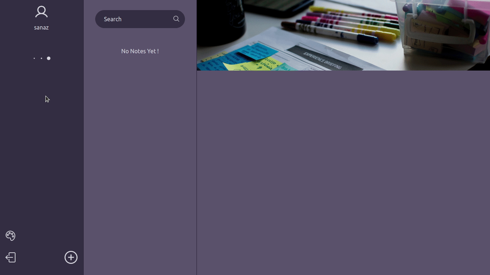

# Note app

Note app is an notetaking application that allows you to take notes by including text, images, videos, links, lists, checkboxes and support for code snippets, file attachments can be expected in the near future.

Remember is built with React, Redux Toolkit and Firebase. Remeber uses firestore to store the user notes and it uses Editor.js library for editing the notes.

Remember uses three pane layout to organize, edit and save your notes.

 / 

## Core Dependencies

| Package               | For              |
| --------------------- | ---------------- |
| Redux Toolkit         | State Management |
| Ui Framework          | Tailwind   |
| Editor.js and Plugins | Editing notes    |

## Features

- Include text, images, videos, links, lists, checkboxes
- Organize notes by notebooks
- Search notes
- Export to PDF
- Seven different themes

